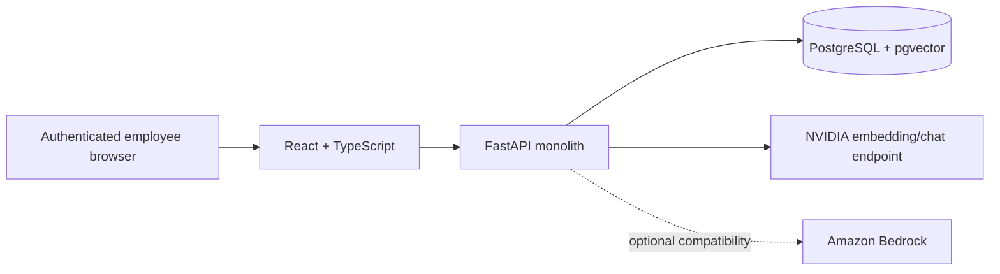

# Architecture

## Local-only product architecture

One monorepo contains one React web client and one FastAPI backend. PostgreSQL with pgvector runs in Docker Compose. The backend alone calls the configured AI provider; the browser never receives AI credentials and never talks directly to PostgreSQL.

## Runtime services

| Service | Responsibility |
|---|---|
| `web` | Product shell, search workspace, authoring, reviews, profiles, responsive UI |
| `api` | Authentication, authorization, repository lifecycle, search, RAG, feedback, audit |
| `postgres` | Structured records, FTS documents, pgvector embeddings, audit data |

No RDS, EC2, ECS, EKS, Kubernetes, ALB, CloudFront, Cognito, or other hosted infrastructure is required for the final buildathon scope.

## Frontend

The authenticated application uses a persistent `AppShell` with grouped navigation, URL-driven search state, TanStack Query caching, and route-aware solution/solver panels. Search query, filters, pagination, selected solution, and selected solver live in the URL so browser Back/Forward and refresh preserve the product context.

Semantic design tokens support light and dark themes. Desktop search uses a master-detail workspace; mobile uses accessible detail sheets.

## Backend

FastAPI remains a single modular service using:

- Pydantic request/response schemas
- SQLAlchemy models and repositories
- Alembic migrations
- JWT/RBAC/object authorization
- Provider-neutral embedding and grounded-generation adapters
- PostgreSQL full-text and exact-error retrieval
- pgvector semantic retrieval
- Append-only review history and structured feedback

## Search flow

1. Authenticate the user.
2. Parse query and filters.
3. Run authorized PostgreSQL FTS and exact-error search.
4. When embeddings are configured, create a query vector and run pgvector search.
5. Merge and score available signals.
6. Apply object authorization and result eligibility.
7. Serialize solver/contact fields from PostgreSQL.
8. When requested and eligible, send only authorized technical records to the configured chat model.
9. Validate citations and return the source records even if generation is unavailable.

## AI adapters

### NVIDIA local showcase

- Embedding: `nvidia/nemotron-3-embed-1b`
- Grounded chat: `moonshotai/kimi-k2.6`
- Credential: ignored local `NVIDIA_API_KEY`

### Bedrock compatibility

The existing Bedrock adapter remains available for a future approved environment. It is not needed for the local buildathon application.

## Data boundaries

PostgreSQL is authoritative for employee names, emails, job titles, teams, departments, ownership, verification, roles, permissions, and contact information. These fields are not embedded and are never generated by the model.

Embedding and generation documents contain only permitted technical fields: title, technologies, environment, problem, symptoms, exact error, root cause, resolution, code evidence, and prevention notes.
