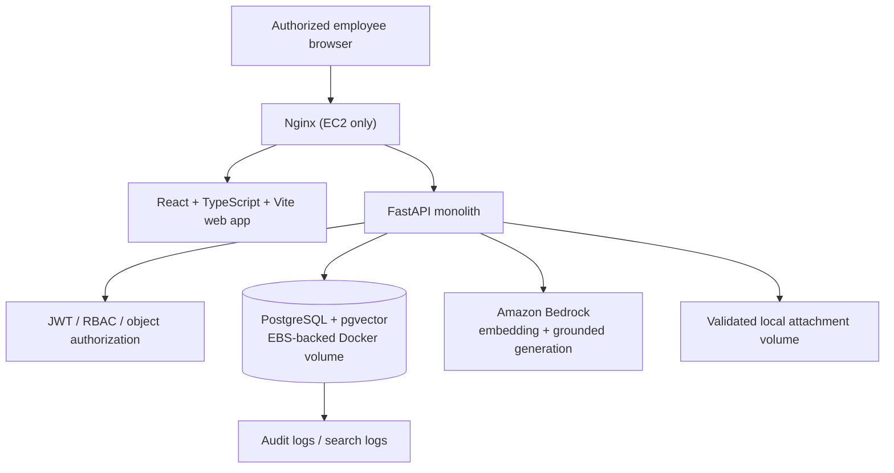

# Architecture

## 1. Locked topology

One monorepo contains one React web client and one FastAPI backend. PostgreSQL with pgvector runs in Docker for local development and the first EC2 deployment. The backend alone calls Amazon Bedrock using an AWS profile locally or an EC2 instance role when deployed. Nginx reverse-proxies the web/API deployment on the single EC2 host.

## 2. Repository boundaries

| Path | Responsibility | Phase 0 state |
|---|---|---|
| `apps/web` | Sole React user interface | Directories only |
| `apps/api` | Sole FastAPI API/RAG/auth application | Directories only |
| `infrastructure/docker` | Container build/config assets | Directories only |
| `infrastructure/nginx` | Reverse-proxy configuration | Directories only |
| `infrastructure/deployment` | EC2 runbook/scripts | Directories only |
| `docs` | Approved product and engineering contracts | Phase 0 complete pending approval |

## 3. Frontend architecture

React, TypeScript, Vite, Tailwind, customized shadcn/ui/Radix, Lucide, Motion for React, React Router, TanStack Query, React Hook Form and Zod are the approved stack. Pages compose feature modules; services are the only API boundary; server state lives in TanStack Query; forms use shared Zod schemas where feasible. Static visible strings originate in `UI_COPY.md` and are compiled into `src/content` in a later phase.

The client never calls Bedrock or PostgreSQL. It stores JWTs using the security decision made in Phase 2 and reacts to API authorization/error codes without fabricating results.

## 4. Backend architecture

The FastAPI monolith uses Pydantic request/response schemas, SQLAlchemy models/repositories, Alembic migrations, service-layer business rules, a `security` boundary for JWT/RBAC/object policy, and a `rag` boundary for Bedrock/retrieval orchestration. Boto3 is isolated behind adapters so test doubles are explicit and production never silently falls back to fake AI.

All SQLAlchemy access is parameterized. FastAPI dependencies authenticate before services access protected resources. API responses follow `API_CONTRACT.md`.

## 5. Request flows

### Authenticated search

1. Browser sends a JWT to `POST /api/v1/search`.
2. API authenticates, validates query/filters, constructs the caller’s visibility scope.
3. RAG service obtains query embedding from Bedrock, runs pgvector/FTS/exact-error candidates, filters authorization, merges/reranks/confidence-gates.
4. API retrieves structured owners and approved contact fields only for authorized hits.
5. Only permitted solution context reaches the generation model. The response contains citations and structured solver data from PostgreSQL.

### Solution submission/review

1. Author submits validated draft or review-ready content.
2. API authorizes ownership, persists structured challenge/solution data and audit event.
3. Reviewer applies a decision and visibility scope; verification records are immutable events.
4. Publish/verification changes enqueue embedding work in a later phase; no vector is generated by a client.

## 6. Deployment boundaries

Local and deployed runtime: `frontend`, `backend`, `postgres`, and `nginx` (deployment). The PostgreSQL Docker named volume resides on persistent EBS-backed EC2 storage. Security groups limit inbound traffic; IAM grants the backend/EC2 instance only needed Bedrock invocation rights. No RDS, Aurora, ECS, EKS, Kubernetes, ALB, CloudFront, Cognito, NAT Gateway, multi-AZ, or microservices are part of the MVP.

## 7. Configuration and observability

`.env.example` lists required configuration without secrets. Startup validation in Phase 1 must fail readably for absent required values appropriate to the enabled service. Logs must redact tokens, passwords, AWS credentials, and content designated sensitive. Audit events and API correlation IDs support traceability.

## 8. Architecture invariants

- PostgreSQL is authoritative for structured people, permissions, ownership, and verification.
- pgvector and Bedrock remain mandatory for semantic/RAG phases.
- Permission filtering precedes Bedrock context construction.
- A Bedrock outage produces an explicit unavailable state for dependent features, never fake generated output.
- Major changes require an approved ADR before implementation.
