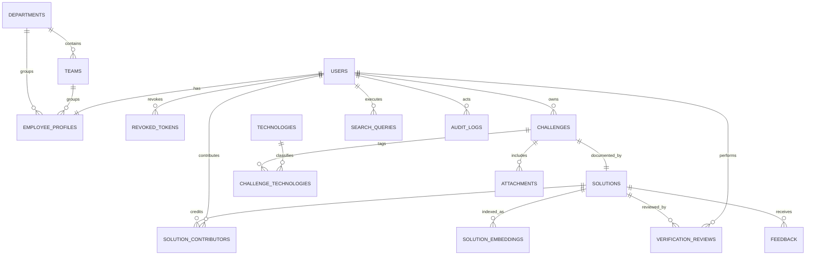

# Database Schema

PostgreSQL 16 with the `vector` extension is the only MVP data store. All timestamps are `timestamptz` in UTC. All primary keys are `uuid` generated server-side. `created_at` and `updated_at` are non-null audit fields unless stated otherwise. Application deletes are soft deletes (`deleted_at`) for knowledge records and profiles; audit logs and review decisions are append-only.

## 1. Types and common rules

- `app_role`: `employee`, `reviewer`, `administrator`.
- `visibility_level`: `company`, `department`, `team`, `restricted`, `administrator`.
- `content_status`: `draft`, `submitted`, `changes_requested`, `verified`, `rejected`, `archived`.
- `review_decision`: `verified`, `changes_requested`, `rejected`, `revoked`.
- `attachment_status`: `pending_scan`, `available`, `rejected`, `deleted`.
- `feedback_value`: `helpful`, `not_helpful`, `resolved_my_issue`.
- Use `citext` for normalized unique email/name columns and `pg_trgm` where described. Every foreign key uses `RESTRICT` unless an explicit cascade appears below.

## 2. Organization and identity tables

| Table | Columns | Constraints and indexes |
|---|---|---|
| `departments` | `id uuid PK`; `name citext`; `slug text`; `description text nullable`; audit fields; `deleted_at` | `UNIQUE(name)`, `UNIQUE(slug)`, active-row lookup index on `deleted_at IS NULL`. |
| `teams` | `id PK`; `department_id uuid FK departments`; `name citext`; `slug text`; audit fields; `deleted_at` | `UNIQUE(department_id,name)`, `UNIQUE(slug)`, index `department_id`; restrict department deletion. |
| `users` | `id PK`; `email citext`; `password_hash text`; `role app_role`; `is_active bool default true`; `last_login_at timestamptz nullable`; audit fields; `deleted_at` | `UNIQUE(email)`; indexes on `(is_active, role)` and active rows. Password hashes only; no plaintext tokens. |
| `revoked_tokens` | `jti uuid PK`; `user_id uuid FK users`; `expires_at timestamptz`; `revoked_at timestamptz` | Token identifiers only; never stores the JWT. Indexes on `user_id` and `expires_at` support access checks and expiry cleanup. User deletion is restricted while a revocation record remains. |
| `employee_profiles` | `user_id uuid PK/FK users ON DELETE CASCADE`; `display_name varchar(160)`; `job_title varchar(160)`; `department_id FK`; `team_id FK`; `contact_email citext`; `contact_handle varchar(160) nullable`; `skills jsonb default []`; `bio text nullable`; `avatar_key text nullable`; audit fields; `deleted_at` | check contact email equals user email or approved alternate validation; indexes on team/department; contact fields and profile skills never enter embeddings. |

## 3. Knowledge tables

| Table | Columns | Constraints and indexes |
|---|---|---|
| `technologies` | `id PK`; `name citext`; `slug text`; `category varchar(80) nullable`; audit fields; `deleted_at` | `UNIQUE(name)`, `UNIQUE(slug)`, btree slug index. |
| `challenges` | `id PK`; `title varchar(240)`; `problem_description text`; `symptoms text`; `exact_error_message text nullable`; `environment text nullable`; `status content_status`; `visibility visibility_level`; `department_id FK nullable`; `team_id FK nullable`; `owner_user_id FK users`; `created_by_user_id FK users`; `updated_by_user_id FK users`; `submitted_at/archived_at/deleted_at timestamptz nullable`; audit fields; `search_document tsvector` | checks: title nonblank; department required for department visibility; team required for team visibility; restricted/admin require verified state before general retrieval. Index `(status, visibility, deleted_at)`, GIN `search_document`, GIN trigram `exact_error_message`, owner index. |
| `solutions` | `id PK`; `challenge_id FK challenges ON DELETE CASCADE`; `root_cause text`; `resolution_steps jsonb`; `code_snippets jsonb default []`; `prevention_notes text nullable`; `status content_status`; `solved_at date nullable`; `primary_owner_user_id FK users`; audit fields; `deleted_at` | one active solution per challenge initially: `UNIQUE(challenge_id)`; check steps is JSON array and root cause nonblank once submitted; indexes challenge/status/owner. |
| `challenge_technologies` | `challenge_id FK challenges ON DELETE CASCADE`; `technology_id FK technologies`; audit fields | composite PK; index technology-to-challenge. |
| `solution_contributors` | `solution_id FK solutions ON DELETE CASCADE`; `user_id FK users`; `contribution_role varchar(40)`; audit fields | composite PK; check role in `primary`, `contributor`, `reviewer`; unique primary is enforced by service/partial index; no AI-generated ownership. |
| `attachments` | `id PK`; `challenge_id FK challenges ON DELETE CASCADE`; `uploaded_by_user_id FK users`; `storage_key text`; `original_filename varchar(255)`; `content_type varchar(100)`; `size_bytes bigint`; `sha256 char(64)`; `status attachment_status`; `scan_result text nullable`; `deleted_at` | `UNIQUE(storage_key)`, `UNIQUE(challenge_id,sha256)`, check size > 0 and <= configured maximum; MIME, filename and content checks are enforced by the app. Phase 3 creates `pending_scan` rows only; downloads remain denied until an approved scanner sets `available`. |
| `verification_reviews` | `id PK`; `solution_id FK solutions`; `reviewer_user_id FK users`; `decision review_decision`; `notes text nullable`; `visibility_after visibility_level nullable`; `created_at`; `supersedes_review_id FK self nullable` | append-only; index `(solution_id, created_at DESC)`; reviewers cannot review their own solution; current verification derived from latest effective review/service field. |

## 4. Retrieval, feedback, and audit tables

| Table | Columns | Constraints and indexes |
|---|---|---|
| `solution_embeddings` | `id PK`; `solution_id FK solutions ON DELETE CASCADE`; `searchable_text text`; `embedding vector`; `embedding_model varchar(255)`; `content_hash char(64)`; created/updated timestamps | `UNIQUE(solution_id, embedding_model, content_hash)`; Phase 7 uses a bounded cosine scan. The `vector` column intentionally remains dimension-flexible so an embedding model change stays an explicit ADR/re-embedding operation; a dimension-specific HNSW index is deferred to the Phase 10 corpus benchmark and deployment plan. `searchable_text` excludes names, emails, job titles, teams, departments, contact data, roles, ownership, verification, and permissions. |
| `feedback` | `id PK`; `solution_id FK solutions`; `submitted_by_user_id FK users`; `search_query_id FK search_queries nullable`; `value feedback_value`; `comment text nullable`; audit fields | `UNIQUE(solution_id,submitted_by_user_id,search_query_id)` when query present; indexes solution/value and query; soft deletion is not allowed—moderation records status in audit. |
| `search_queries` | `id PK`; `requested_by_user_id FK users`; `query_text text`; `filters jsonb`; `result_count smallint`; `top_solution_id FK solutions nullable`; `confidence numeric(5,4) nullable`; `outcome varchar(32)`; `latency_ms integer`; `bedrock_generation_used bool`; `created_at` | check latency nonnegative; indexes user/created time, outcome/time. Query text retention needs policy approval before real use. |
| `audit_logs` | `id PK`; `actor_user_id FK users nullable`; `action varchar(100)`; `entity_type varchar(80)`; `entity_id uuid nullable`; `outcome varchar(32)`; `request_id uuid`; `ip_hash char(64) nullable`; `metadata jsonb`; `created_at` | append-only; indexes `(entity_type,entity_id,created_at DESC)`, actor/time, request ID. Never log passwords, JWTs, AWS credentials, or raw prohibited attachment content. |

Current feedback implementation note: migration `202607220008_feedback_resolved_and_current` adds `resolved_my_issue` and enforces one current feedback row per `(solution_id, submitted_by_user_id)`. `search_query_id` remains optional context on that current row.

## 5. Relationship and visibility model

Visibility is checked against caller role and current profile organization: company = active employee; department = matching department or administrator; team = matching team or administrator; restricted = solution owner, listed contributor, explicitly assigned reviewer, or administrator; administrator = administrator only. Visibility checks apply to candidates, detail records, attachments, contacts, and RAG context.

## 6. Full-text/vector strategy

`challenges.search_document` is a generated/trigger-maintained weighted `tsvector`: title A, exact error A, symptoms B, description B, environment C, technology names B, root cause B, resolution text C. Search configuration is English initially; localization requires an ADR. Exact error uses normalized fragments and trigram matching, with application-side escaping and length limits. Vectors use model-determined dimensions configured and verified at migration/startup; model swaps require a controlled re-embedding plan.

## 7. Migration order

1. Enable `vector`, `citext`, `pg_trgm`, and `pgcrypto` extensions.
2. Create enums, departments, teams, users, profiles, and technologies.
3. Create challenges, solutions, tag/contributor/attachment relations and content constraints.
4. Create review, feedback, search-query and append-only audit tables.
5. Create token-revocation storage after users for Phase 2 authentication.
6. Add FTS trigger/generated column and GIN/trigram indexes. Phase 5 applies this as `202607210003_phase_5_keyword_search` plus corrective `202607210004_fix_phase_5_search_trigger`; trigger-maintained weighted documents include permitted challenge, paired solution, and technology text only.
7. Add `solution_embeddings`, vector index selected after corpus benchmark, and re-embedding metadata.
8. Add profile skills as structured profile metadata.
9. Relax draft-only solution constraints so incomplete drafts can be saved while submitted/verified records still require complete technical content.
10. Add resolved-feedback support and one-current-feedback-record uniqueness.
11. Seed only fictional development data through a separate idempotent command.

Schema migrations are forward-only Alembic revisions; production rollback is a new compensating migration unless a tested reversible revision is safe.
